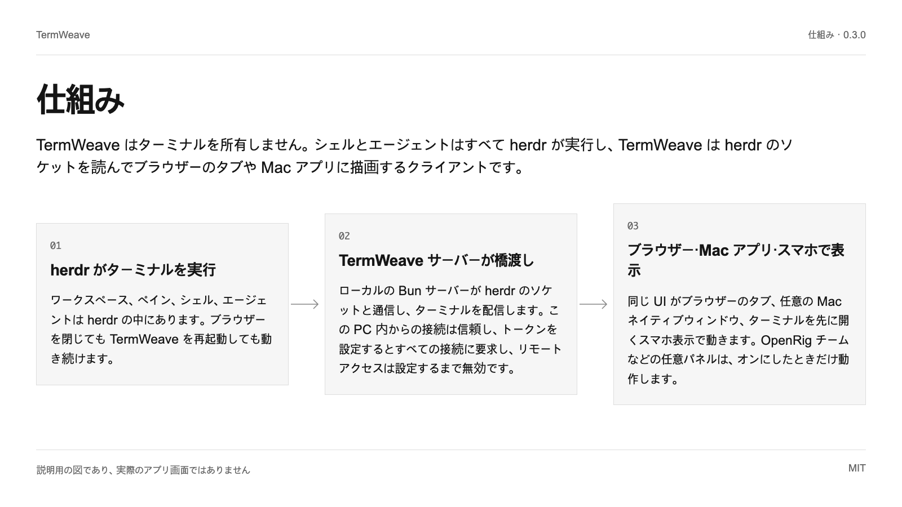
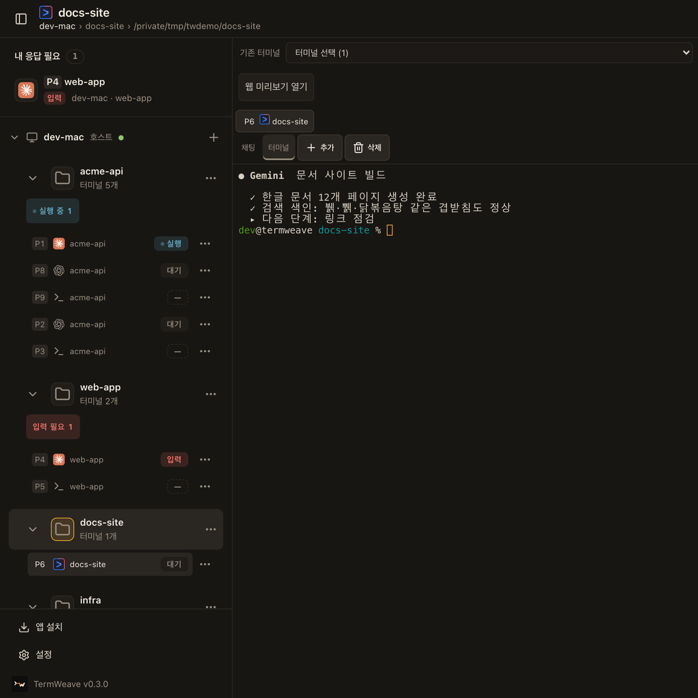

# TermWeave

herdr 向けの cmux 風 Web・Mac クライアントです。ワークスペースごとの分割、番号付きペイン、エージェントアイコン、入力待ち一覧、正しい韓国語入力を備えます。

[English](README.md) | [한국어](README.ko.md) | **日本語** | [简体中文](README.zh.md)


0.3.0 · MIT

## 使う理由

| | |
| --- | --- |
| cmux 風のワークスペースと番号付きドッキングペイン | ワークスペースごとに分割レイアウトを保持します。右や下に分割し、タブをグループ間でドラッグし、サイズ変更やズームもできます。すべてのターミナルには P3 のような通し番号が付き、サイドバーでどのエージェント（Claude Code、Codex、Gemini CLI など）が動いているか分かります。 |
| 入力待ちのエージェントをすぐ見つけて応答 | 「Needs you」一覧に入力待ちのペインが集まり、各ワークスペースに実行中と入力待ちの件数が表示されます。ペインを開き、ターミナルまたはチャット画面からデスクトップでもスマートフォンでも応答できます。 |
| Mac ネイティブウィンドウと正しい韓国語入力 | WebKit（Safari と Mac アプリ）では macOS の韓国語 IME が音節をその場で書き換え、xterm 単体ではその入力が失われます。TermWeave は入力欄の変化をそのまま送り直すため、速く打ってもハングルが正確に届き、スペースは通常の空白のまま、小さな文字でもハングルの上が欠けません。 |

## クイックスタート

macOS または Linux、Bun 1.4.2、Node 18 以上、別途インストールした herdr が必要です（macOS の herdr 0.9.1 で検証）。コマンドは通常のシェルで実行します。

```text
sh install.sh --check
TERMWEAVE_INSTALL_DIR="$HOME/.local/share/termweave-owned" sh install.sh --install
bun "$HOME/.local/share/termweave-owned/scripts/owned-server.ts" start
```

チェックは不足している前提条件を報告し、インストールはローカルのソースだけをビルドし、サーバーはこの PC 内だけで開くアドレスを表示します。そのアドレスをブラウザーで開きます。自分で設定しない限り、この PC の外には公開されません。

## 仕組み

TermWeave はターミナルを所有しません。シェルとエージェントはすべて herdr が実行し、TermWeave は herdr のソケットを読んでブラウザーのタブや Mac アプリに描画するクライアントです。



### herdr がターミナルを実行

ワークスペース、ペイン、シェル、エージェントは herdr の中にあります。ブラウザーを閉じても TermWeave を再起動しても動き続けます。

### TermWeave サーバーが橋渡し

ローカルの Bun サーバーが herdr のソケットと通信し、ターミナルを配信します。この PC 内からの接続は信頼し、トークンを設定するとすべての接続に要求し、リモートアクセスは設定するまで無効です。

### ブラウザー・Mac アプリ・スマホで表示

同じ UI がブラウザーのタブ、任意の Mac ネイティブウィンドウ、ターミナルを先に開くスマホ表示で動きます。OpenRig チームなどの任意パネルは、オンにしたときだけ動作します。

## 活用例

### 複数のコーディングエージェントを並べて実行

Claude Code、Codex、テスト実行を一つのワークスペースに置き、エージェントアイコンと P 番号で見分け、入力待ちのものへすぐ移動します。

### プロジェクトごとにフォルダーセッション

PC の + でフォルダーセッションを作成します。まずフォルダーを選んで名前を付け、エージェントを選ばなければ通常のシェルで始まります。メニューから名前変更、色付け、終了ができます。

### マシン名を隠して画面共有

TERMWEAVE_MACHINE_NAME を設定すると、デモや録画中にサイドバーへ別の PC 名を表示できます。この README の画面もその方法で撮影しました。




## 制約とプライバシー

- herdr は必須で、別途インストールが必要です。TermWeave は herdr を同梱も更新もしません。これまでの検証は macOS の herdr 0.9.1 のみで、Linux と Windows は未検証です。

- herdr-web-ui（MIT）から派生した独立プロジェクトです。herdr、cmux、Anthropic、OpenAI、Google とは提携しておらず、エージェントアイコンはペインで動くプログラムを示すためだけのものです。

- 実機スマホの IME、iOS の Safari、支援技術はまだ手動確認が必要です。リモートアクセス、Android 連携、OpenRig チームは任意機能で、既定ではオフです。

## 検証状況

- **実行確認済み**: WebKit で実際の macOS 韓国語 IME を使い、キー間隔 60・25・12 ms で入力したハングルがシェルに正確に届きました（9 文中 9 文、スペースを含む）。
- **実行確認済み**: 画面はこのソースをサンプルプロジェクト入りの別のデモ用 herdr セッションに接続して撮影しました。個人のワークスペースは写っていません。
- **文書に記載**: 公開版を作るたびにローカルで単体テストと型チェックを実行します。まだ外部 CI バッジはありません。

## 次のステップ

リリースごとの変更は CHANGELOG.termweave.md、リモートアクセスを有効にする前の注意は SECURITY.md、修正の送り方は CONTRIBUTING.md をご覧ください。

<details>
<summary>根拠一覧</summary>

[JSON](docs/showcase/sources.json)

- `readme-quickstart`: `README.md`, L7–L15 (文書に記載)
- `dock-split`: `src/components/DockGroup.tsx`, L40–L64 (実行確認済み)
- `pane-number`: `src/lib/paneNumber.ts`, L3–L7 (コード確認済み)
- `agent-marks`: `src/components/AgentMark.tsx`, L160–L167 (実行確認済み)
- `needs-input`: `src/components/Sidebar.tsx`, L254–L255 (実行確認済み)
- `session-color`: `src/components/Sidebar.tsx`, L161–L161 (コード確認済み)
- `folder-session`: `src/components/NewSessionDialog.tsx`, L39–L64 (実行確認済み)
- `ime-diff`: `src/lib/imeDiff.ts`, L1–L25 (実行確認済み)
- `ime-terminal`: `src/components/PaneTerminal.tsx`, L308–L331 (実行確認済み)
- `hangul-row`: `src/lib/terminalGlyphs.ts`, L270–L273 (実行確認済み)
- `default-view`: `src/lib/settings.ts`, L117–L117 (コード確認済み)
- `access-local`: `server/access.ts`, L84–L95 (コード確認済み)
- `machine-name`: `server/machines.ts`, L92–L93 (実行確認済み)
- `openrig-panel`: `src/components/OpenRigPanel.tsx`, L114–L120 (実行確認済み)
- `terminal-menu`: `src/components/TerminalMenu.tsx`, L24–L25 (コード確認済み)
- `license`: `LICENSE`, L1–L3 (文書に記載)
- `changelog`: `CHANGELOG.termweave.md`, L1–L6 (文書に記載)

- `workspaces` → `dock-split`, `pane-number`, `agent-marks`
- `needs-you` → `needs-input`, `default-view`
- `korean` → `ime-diff`, `ime-terminal`, `hangul-row`
- `herdr` → `readme-quickstart`
- `server` → `access-local`
- `clients` → `default-view`, `openrig-panel`
- `multi-agent` → `agent-marks`, `pane-number`, `needs-input`
- `folders` → `folder-session`, `session-color`, `terminal-menu`
- `share-screen` → `machine-name`
- `herdr-required` → `readme-quickstart`
- `not-official` → `license`, `agent-marks`
- `manual-checks` → `readme-quickstart`, `openrig-panel`
- `ime-test` → `ime-diff`, `ime-terminal`
- `screens` → `dock-split`, `machine-name`
- `unit` → `changelog`
- `quickstart` → `readme-quickstart`

</details>
