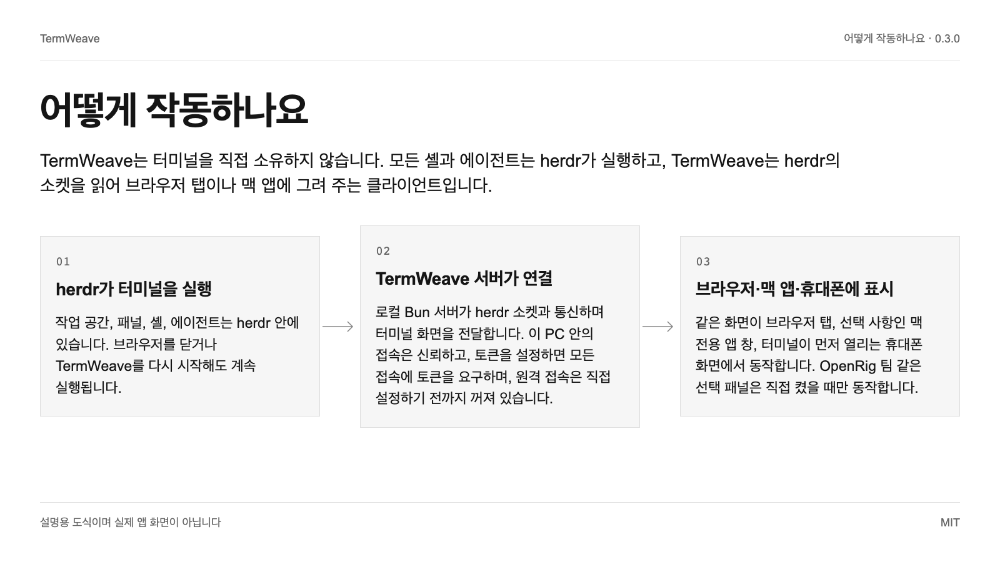

# TermWeave

herdr를 위한 cmux 스타일 웹·맥 클라이언트입니다. 작업 공간별 분할 배치, 번호 붙은 패널, 에이전트 아이콘, 응답 필요 목록, 깨지지 않는 한글 입력을 제공합니다.

[English](README.md) | **한국어** | [日本語](README.ja.md) | [简体中文](README.zh.md)


0.3.0 · MIT

## 왜 쓰나요

| | |
| --- | --- |
| cmux처럼 작업 공간마다 번호가 붙은 터미널 배치 | 작업 공간마다 분할 배치를 따로 기억합니다. 나누기, 끌어 옮기기, 크기 조절, 확대가 됩니다. 모든 터미널에 P3 같은 전역 번호와 실행 중인 에이전트 아이콘이 붙습니다. |
| 응답을 기다리는 에이전트를 바로 찾아 답하기 | '응답 필요' 목록에 입력을 기다리는 패널이 모이고, 작업 공간마다 실행 중·응답 필요 개수가 보입니다. 데스크톱이나 휴대폰에서 터미널 또는 채팅으로 바로 답합니다. |
| 맥 전용 앱 창과 깨지지 않는 한글 입력 | WebKit에서는 macOS 한국어 입력기가 음절을 제자리에서 고쳐 써서 xterm만으로는 글자가 빠집니다. TermWeave는 입력 변화를 그대로 다시 보내므로 빠르게 쳐도 한글과 띄어쓰기가 정확합니다. |

## 빠른 시작

macOS 또는 Linux, Bun 1.4.2, Node 18 이상, 그리고 별도로 설치한 herdr가 필요합니다(macOS의 herdr 0.9.1로 검증). 명령은 일반 셸에서 실행합니다.

```text
sh install.sh --check
TERMWEAVE_INSTALL_DIR="$HOME/.local/share/termweave-owned" sh install.sh --install
bun "$HOME/.local/share/termweave-owned/scripts/owned-server.ts" start
```

점검 단계는 빠진 준비물을 알려 주고, 설치는 로컬 소스만 빌드하며, 서버는 이 PC 안에서만 열리는 주소를 출력합니다. 그 주소를 브라우저로 엽니다. 직접 설정하지 않는 한 이 PC 밖으로는 열리지 않습니다.

## 어떻게 작동하나요

TermWeave는 터미널을 직접 소유하지 않습니다. 모든 셸과 에이전트는 herdr가 실행하고, TermWeave는 herdr의 소켓을 읽어 브라우저 탭이나 맥 앱에 그려 주는 클라이언트입니다.



### herdr가 터미널을 실행

작업 공간, 패널, 셸, 에이전트는 herdr 안에 있습니다. 브라우저를 닫거나 TermWeave를 다시 시작해도 계속 실행됩니다.

### TermWeave 서버가 연결

로컬 Bun 서버가 herdr 소켓과 통신하며 터미널 화면을 전달합니다. 이 PC 안의 접속은 신뢰하고, 토큰을 설정하면 모든 접속에 토큰을 요구하며, 원격 접속은 직접 설정하기 전까지 꺼져 있습니다.

### 브라우저·맥 앱·휴대폰에 표시

같은 화면이 브라우저 탭, 선택 사항인 맥 전용 앱 창, 터미널이 먼저 열리는 휴대폰 화면에서 동작합니다. OpenRig 팀 같은 선택 패널은 직접 켰을 때만 동작합니다.

## 사용 예시

### 코딩 에이전트 여러 개를 나란히 실행

Claude Code, Codex, 테스트 실행 창을 한 작업 공간에 두고, 에이전트 아이콘과 P 번호로 구분하며, 응답이 필요한 쪽으로 바로 이동합니다.

### 프로젝트마다 폴더 세션 하나

PC 옆의 +는 폴더 세션을 만듭니다. 폴더를 먼저 고르고 이름을 붙이며, 에이전트를 고르지 않으면 일반 셸로 시작합니다. 메뉴에서 이름 변경, 색상 지정, 닫기를 할 수 있습니다.

### 컴퓨터 이름을 숨기고 화면 공유

TERMWEAVE_MACHINE_NAME을 설정하면 시연이나 녹화 중 사이드바에 다른 PC 이름이 표시됩니다. 이 README의 화면도 그렇게 촬영했습니다.


## 한계와 개인정보

- herdr가 반드시 필요하며 따로 설치해야 합니다. TermWeave는 herdr를 포함하거나 업그레이드하지 않습니다. 지금까지는 macOS의 herdr 0.9.1로만 검증했고, Linux와 Windows는 검증하지 않았습니다.

- herdr-web-ui(MIT)에서 파생한 독립 프로젝트입니다. herdr, cmux, Anthropic, OpenAI, Google과 제휴 관계가 없으며, 에이전트 아이콘은 패널에서 어떤 프로그램이 실행 중인지 표시하는 용도입니다.

- 실제 휴대폰 입력기, iOS 사파리, 보조 기술은 아직 수동 확인이 필요합니다. 원격 접속, 안드로이드 연동, OpenRig 팀은 선택 기능이며 기본적으로 꺼져 있습니다.

## 검증 상태

- **실행 확인**: WebKit에서 실제 macOS 한국어 입력기로 키 간격 60·25·12ms로 친 한글이 셸에 정확히 들어갔습니다(문장 9개 중 9개, 띄어쓰기 포함).
- **실행 확인**: 화면은 이 소스를 샘플 프로젝트가 들어 있는 별도의 시연용 herdr 세션에 연결해 촬영했습니다. 개인 작업 공간은 나오지 않습니다.
- **문서 기준**: 공개본을 만들 때마다 로컬에서 단위 테스트와 타입 검사를 실행합니다. 아직 외부 CI 배지는 없습니다.

## 다음 단계

릴리스별 변경 사항은 CHANGELOG.termweave.md에서, 원격 접속을 켜기 전 주의 사항은 SECURITY.md에서, 수정 제안 방법은 CONTRIBUTING.md에서 확인할 수 있습니다.

<details>
<summary>근거 목록</summary>

[JSON](docs/showcase/sources.json)

- `readme-quickstart`: `README.md`, L7–L15 (문서 기준)
- `dock-split`: `src/components/DockGroup.tsx`, L40–L64 (실행 확인)
- `pane-number`: `src/lib/paneNumber.ts`, L3–L7 (코드 확인)
- `agent-marks`: `src/components/AgentMark.tsx`, L160–L167 (실행 확인)
- `needs-input`: `src/components/Sidebar.tsx`, L254–L255 (실행 확인)
- `session-color`: `src/components/Sidebar.tsx`, L161–L161 (코드 확인)
- `folder-session`: `src/components/NewSessionDialog.tsx`, L39–L64 (실행 확인)
- `ime-diff`: `src/lib/imeDiff.ts`, L1–L25 (실행 확인)
- `ime-terminal`: `src/components/PaneTerminal.tsx`, L308–L331 (실행 확인)
- `hangul-row`: `src/lib/terminalGlyphs.ts`, L270–L273 (실행 확인)
- `default-view`: `src/lib/settings.ts`, L117–L117 (코드 확인)
- `access-local`: `server/access.ts`, L84–L95 (코드 확인)
- `machine-name`: `server/machines.ts`, L92–L93 (실행 확인)
- `openrig-panel`: `src/components/OpenRigPanel.tsx`, L114–L120 (실행 확인)
- `terminal-menu`: `src/components/TerminalMenu.tsx`, L24–L25 (코드 확인)
- `license`: `LICENSE`, L1–L3 (문서 기준)
- `changelog`: `CHANGELOG.termweave.md`, L1–L6 (문서 기준)

- `workspaces` → `dock-split`, `pane-number`, `agent-marks`
- `needs-you` → `needs-input`, `default-view`
- `korean` → `ime-diff`, `ime-terminal`, `hangul-row`
- `herdr` → `readme-quickstart`
- `server` → `access-local`
- `clients` → `default-view`, `openrig-panel`
- `multi-agent` → `agent-marks`, `pane-number`, `needs-input`
- `folders` → `folder-session`, `session-color`, `terminal-menu`
- `share-screen` → `machine-name`
- `herdr-required` → `readme-quickstart`
- `not-official` → `license`, `agent-marks`
- `manual-checks` → `readme-quickstart`, `openrig-panel`
- `ime-test` → `ime-diff`, `ime-terminal`
- `screens` → `dock-split`, `machine-name`
- `unit` → `changelog`
- `quickstart` → `readme-quickstart`

</details>
