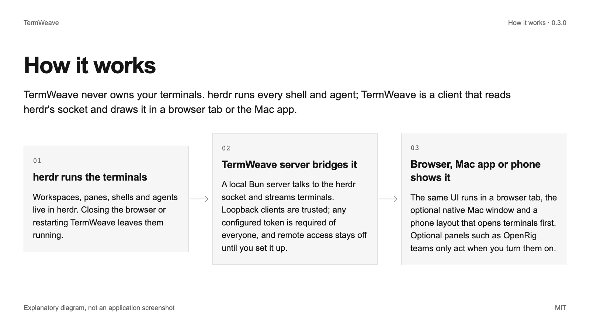

# TermWeave

A cmux-style web and Mac client for herdr: docked, numbered panes per workspace, agent icons, a Needs-you list and correct Korean input.

**English** | [한국어](README.ko.md) | [日本語](README.ja.md) | [简体中文](README.zh.md)


0.3.0 · MIT

## Why use it

| | |
| --- | --- |
| cmux-style workspaces with numbered, docked panes | Each workspace keeps its own split layout: split, drag, resize and zoom. Every terminal gets a global number like P3 and an icon for the agent running in it. |
| See and answer the agents that need you | A Needs you list collects panes waiting for input, and each workspace shows Running and Needs input counts. Answer from the terminal or chat, on desktop or phone. |
| Native Mac window with correct Korean input | In WebKit the macOS Korean IME rewrites syllables in place, which xterm alone drops. TermWeave replays each edit, so fast Hangul typing arrives exactly and spaces stay plain. |

## Quick start

macOS or Linux, Bun 1.4.2, Node 18+ and a separately installed herdr (validated with herdr 0.9.1 on macOS). Run the commands in a normal shell.

```text
sh install.sh --check
TERMWEAVE_INSTALL_DIR="$HOME/.local/share/termweave-owned" sh install.sh --install
bun "$HOME/.local/share/termweave-owned/scripts/owned-server.ts" start
```

The check reports missing prerequisites, the install builds local source only, and the server prints a loopback address. Open it in a browser. Nothing is exposed outside this PC unless you configure access yourself.

## How it works

TermWeave never owns your terminals. herdr runs every shell and agent; TermWeave is a client that reads herdr's socket and draws it in a browser tab or the Mac app.



### herdr runs the terminals

Workspaces, panes, shells and agents live in herdr. Closing the browser or restarting TermWeave leaves them running.

### TermWeave server bridges it

A local Bun server talks to the herdr socket and streams terminals. Loopback clients are trusted; any configured token is required of everyone, and remote access stays off until you set it up.

### Browser, Mac app or phone shows it

The same UI runs in a browser tab, the optional native Mac window and a phone layout that opens terminals first. Optional panels such as OpenRig teams only act when you turn them on.

## Use cases

### Run several coding agents side by side

Keep Claude Code, Codex and a test runner in one workspace, tell them apart by agent icon and P number, and jump to whichever one needs input.

### One folder session per project

The + on a PC creates a folder session: pick a folder first, name it, and start a plain shell unless you choose an agent. Rename, color or close it from its menu.

### Share your screen without your machine name

Set TERMWEAVE_MACHINE_NAME to show a neutral PC name in the sidebar during demos and recordings. The screenshots in this README were taken that way.


## Limits and privacy

- herdr is required and installed separately; TermWeave does not bundle or upgrade it. Validation so far used herdr 0.9.1 on macOS; Linux and Windows are not validated.

- Independent project derived from herdr-web-ui (MIT). Not affiliated with herdr, cmux, Anthropic, OpenAI or Google; agent icons only label which program runs in a pane.

- Real phone IME, Safari on iOS and assistive technology still need manual checks. Remote access, the Android companion and OpenRig teams are optional and off by default.

## Verification

- **Execution verified**: Hangul typed through the real macOS Korean IME in WebKit at 60, 25 and 12 ms per key arrived exactly in the shell (9 of 9 sentences, spaces included).
- **Execution verified**: Screenshots come from this source running against a separate demo herdr session with sample projects; no personal workspace is shown.
- **Documented**: Unit tests and type checks run locally before each export; there is no hosted CI badge yet.

## Next steps

Read CHANGELOG.termweave.md for what changed in each release, SECURITY.md before enabling remote access, and CONTRIBUTING.md to send fixes.

<details>
<summary>Source map</summary>

[JSON](docs/showcase/sources.json)

- `readme-quickstart`: `README.md`, L7–L15 (Documented)
- `dock-split`: `src/components/DockGroup.tsx`, L40–L64 (Execution verified)
- `pane-number`: `src/lib/paneNumber.ts`, L3–L7 (Source inspected)
- `agent-marks`: `src/components/AgentMark.tsx`, L160–L167 (Execution verified)
- `needs-input`: `src/components/Sidebar.tsx`, L254–L255 (Execution verified)
- `session-color`: `src/components/Sidebar.tsx`, L161–L161 (Source inspected)
- `folder-session`: `src/components/NewSessionDialog.tsx`, L39–L64 (Execution verified)
- `ime-diff`: `src/lib/imeDiff.ts`, L1–L25 (Execution verified)
- `ime-terminal`: `src/components/PaneTerminal.tsx`, L308–L331 (Execution verified)
- `hangul-row`: `src/lib/terminalGlyphs.ts`, L270–L273 (Execution verified)
- `default-view`: `src/lib/settings.ts`, L117–L117 (Source inspected)
- `access-local`: `server/access.ts`, L84–L95 (Source inspected)
- `machine-name`: `server/machines.ts`, L92–L93 (Execution verified)
- `openrig-panel`: `src/components/OpenRigPanel.tsx`, L114–L120 (Execution verified)
- `terminal-menu`: `src/components/TerminalMenu.tsx`, L24–L25 (Source inspected)
- `license`: `LICENSE`, L1–L3 (Documented)
- `changelog`: `CHANGELOG.termweave.md`, L1–L6 (Documented)

- `workspaces` → `dock-split`, `pane-number`, `agent-marks`
- `needs-you` → `needs-input`, `default-view`
- `korean` → `ime-diff`, `ime-terminal`, `hangul-row`
- `herdr` → `readme-quickstart`
- `server` → `access-local`
- `clients` → `default-view`, `openrig-panel`
- `multi-agent` → `agent-marks`, `pane-number`, `needs-input`
- `folders` → `folder-session`, `session-color`, `terminal-menu`
- `share-screen` → `machine-name`
- `herdr-required` → `readme-quickstart`
- `not-official` → `license`, `agent-marks`
- `manual-checks` → `readme-quickstart`, `openrig-panel`
- `ime-test` → `ime-diff`, `ime-terminal`
- `screens` → `dock-split`, `machine-name`
- `unit` → `changelog`
- `quickstart` → `readme-quickstart`

</details>
