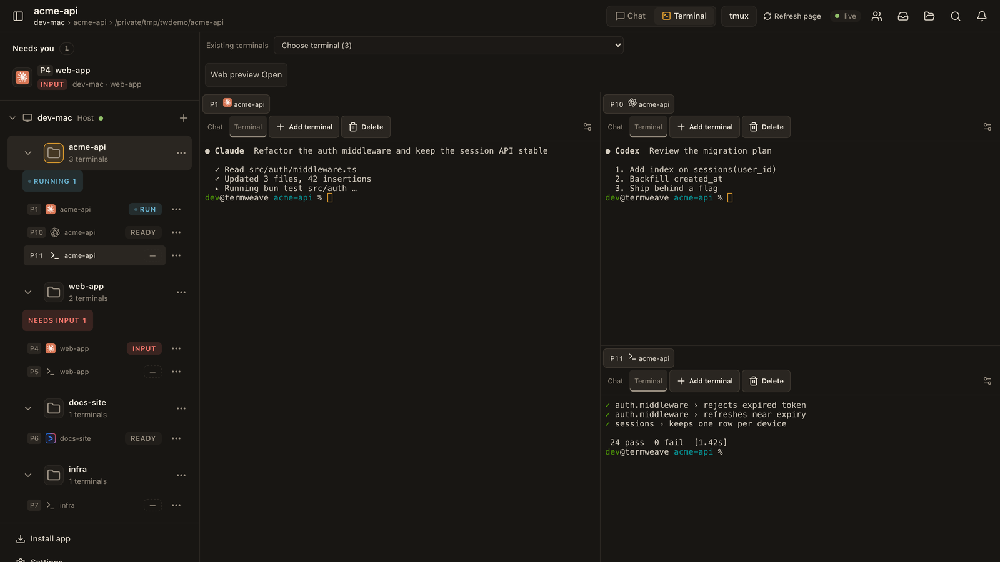
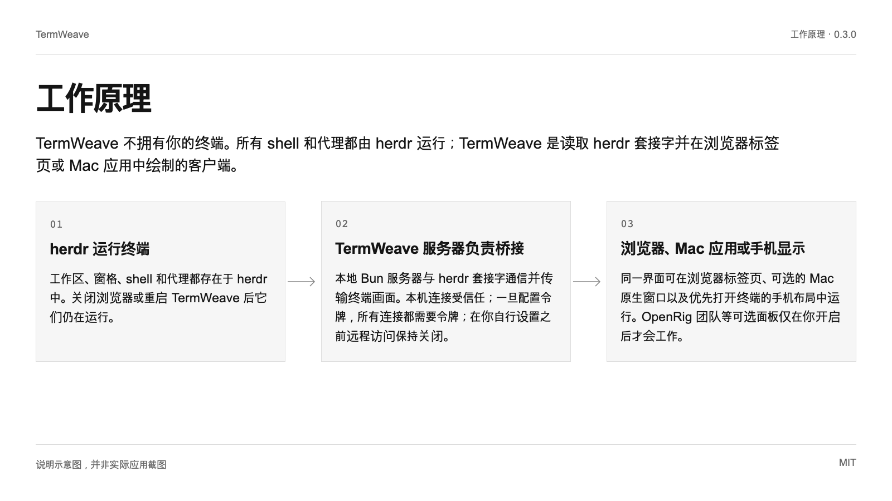
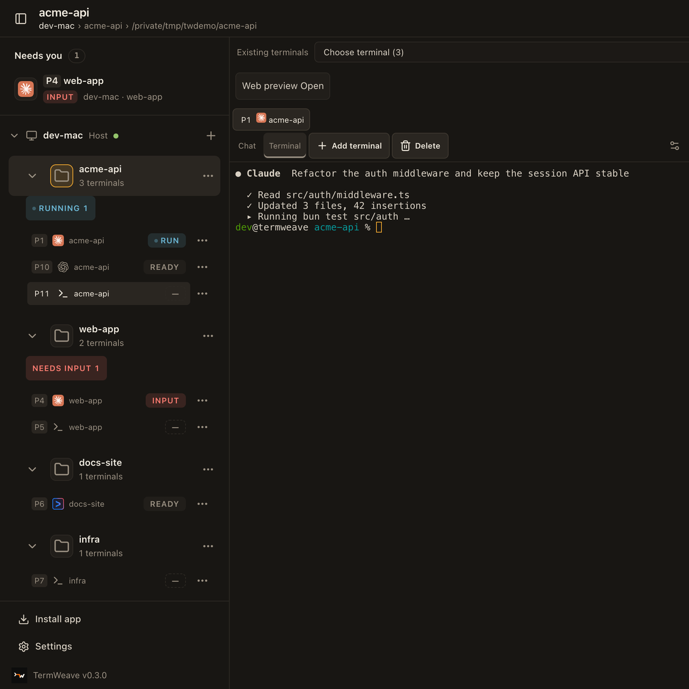
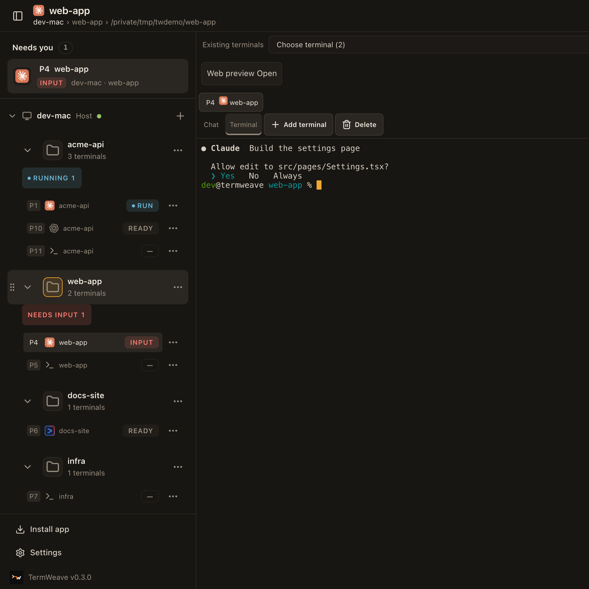

# TermWeave

面向 herdr 的 cmux 风格 Web 与 Mac 客户端：在每个工作区内拆分和停靠终端，一眼看清带编号的窗格及其中运行的 AI 代理，直接回应等待输入的代理，韩文输入也不会出错。

[English](README.md) | [한국어](README.ko.md) | [日本語](README.ja.md) | **简体中文**



0.3.0 · MIT

## 为什么使用

| | |
| --- | --- |
| cmux 风格的工作区与带编号的停靠窗格 | 每个工作区都保留自己的拆分布局。可以向右或向下拆分、在分组之间拖动标签页、调整大小和放大。每个终端都有 P3 这样的全局编号，侧边栏会显示其中运行的代理（Claude Code、Codex、Gemini CLI 等）。 |
| 立即找到并回应等待你的代理 | “Needs you”列表汇集等待输入的窗格，每个工作区显示运行中和需要输入的数量。打开窗格即可在终端或聊天视图中回应，桌面和手机均可使用。 |
| Mac 原生窗口与正确的韩文输入 | 在 WebKit（Safari 与 Mac 应用）中，macOS 韩文输入法会原地改写音节，仅靠 xterm 会丢失这些输入。TermWeave 按输入框的变化重新发送，因此快速输入韩文也能准确到达，空格保持普通空格，小字号下韩文顶部也不会被裁切。 |

## 快速开始

需要 macOS 或 Linux、Bun 1.4.2、Node 18 及以上，以及单独安装的 herdr（已在 macOS 上用 herdr 0.9.1 验证）。请在普通 shell 中运行命令。

```text
sh install.sh --check
TERMWEAVE_INSTALL_DIR="$HOME/.local/share/termweave-owned" sh install.sh --install
bun "$HOME/.local/share/termweave-owned/scripts/owned-server.ts" start
```

检查步骤会报告缺少的前提条件，安装只构建本地源码，服务器会打印仅在本机可访问的地址。用浏览器打开该地址。除非你自行配置，否则不会对本机以外开放。

## 工作原理

TermWeave 不拥有你的终端。所有 shell 和代理都由 herdr 运行；TermWeave 是读取 herdr 套接字并在浏览器标签页或 Mac 应用中绘制的客户端。



### herdr 运行终端

工作区、窗格、shell 和代理都存在于 herdr 中。关闭浏览器或重启 TermWeave 后它们仍在运行。

### TermWeave 服务器负责桥接

本地 Bun 服务器与 herdr 套接字通信并传输终端画面。本机连接受信任；一旦配置令牌，所有连接都需要令牌；在你自行设置之前远程访问保持关闭。

### 浏览器、Mac 应用或手机显示

同一界面可在浏览器标签页、可选的 Mac 原生窗口以及优先打开终端的手机布局中运行。OpenRig 团队等可选面板仅在你开启后才会工作。

## 使用场景

### 并排运行多个编码代理

把 Claude Code、Codex 和测试运行放在同一工作区，通过代理图标和 P 编号区分，并直接跳到需要输入的那个。

### 每个项目一个文件夹会话

PC 旁的 + 会创建文件夹会话：先选文件夹并命名，不选代理时以普通 shell 启动。可在菜单中重命名、设置颜色或关闭。

### 隐藏机器名后共享屏幕

设置 TERMWEAVE_MACHINE_NAME 后，演示和录屏时侧边栏会显示中性的 PC 名称。本 README 中的截图就是这样拍摄的。






## 限制与隐私

- 必须单独安装 herdr；TermWeave 不捆绑也不升级它。目前仅在 macOS 上用 herdr 0.9.1 验证过，Linux 和 Windows 未验证。

- 这是从 herdr-web-ui（MIT）派生的独立项目，与 herdr、cmux、Anthropic、OpenAI、Google 均无隶属关系；代理图标仅用于标示窗格中运行的程序。

- 真实手机输入法、iOS 上的 Safari 和辅助技术仍需手动检查。远程访问、Android 配套功能和 OpenRig 团队均为可选功能，默认关闭。

## 验证状态

- **已验证运行**: 在 WebKit 中通过真实的 macOS 韩文输入法以每键 60、25、12 毫秒输入的韩文准确到达 shell（9 句中 9 句，含空格）。
- **已验证运行**: 截图来自本源码连接到包含示例项目的独立演示 herdr 会话，未显示任何个人工作区。
- **文档说明**: 每次导出前都会在本地运行单元测试和类型检查；目前还没有托管的 CI 徽章。

## 下一步

各版本的变更见 CHANGELOG.termweave.md，开启远程访问前请阅读 SECURITY.md，提交修复请参阅 CONTRIBUTING.md。

<details>
<summary>依据列表</summary>

[JSON](docs/showcase/sources.json)

- `readme-quickstart`: `README.md`, L7–L15 (文档说明)
- `dock-split`: `src/components/DockGroup.tsx`, L40–L64 (已验证运行)
- `pane-number`: `src/lib/paneNumber.ts`, L3–L7 (已检查代码)
- `agent-marks`: `src/components/AgentMark.tsx`, L160–L167 (已验证运行)
- `needs-input`: `src/components/Sidebar.tsx`, L254–L255 (已验证运行)
- `session-color`: `src/components/Sidebar.tsx`, L161–L161 (已检查代码)
- `folder-session`: `src/components/NewSessionDialog.tsx`, L39–L64 (已验证运行)
- `ime-diff`: `src/lib/imeDiff.ts`, L1–L25 (已验证运行)
- `ime-terminal`: `src/components/PaneTerminal.tsx`, L308–L331 (已验证运行)
- `hangul-row`: `src/lib/terminalGlyphs.ts`, L270–L273 (已验证运行)
- `default-view`: `src/lib/settings.ts`, L117–L117 (已检查代码)
- `access-local`: `server/access.ts`, L84–L95 (已检查代码)
- `machine-name`: `server/machines.ts`, L92–L93 (已验证运行)
- `openrig-panel`: `src/components/OpenRigPanel.tsx`, L114–L120 (已验证运行)
- `terminal-menu`: `src/components/TerminalMenu.tsx`, L24–L25 (已检查代码)
- `license`: `LICENSE`, L1–L3 (文档说明)
- `changelog`: `CHANGELOG.termweave.md`, L1–L6 (文档说明)

- `workspaces` → `dock-split`, `pane-number`, `agent-marks`
- `needs-you` → `needs-input`, `default-view`
- `korean` → `ime-diff`, `ime-terminal`, `hangul-row`
- `herdr` → `readme-quickstart`
- `server` → `access-local`
- `clients` → `default-view`, `openrig-panel`
- `multi-agent` → `agent-marks`, `pane-number`, `needs-input`
- `folders` → `folder-session`, `session-color`, `terminal-menu`
- `share-screen` → `machine-name`
- `herdr-required` → `readme-quickstart`
- `not-official` → `license`, `agent-marks`
- `manual-checks` → `readme-quickstart`, `openrig-panel`
- `ime-test` → `ime-diff`, `ime-terminal`
- `screens` → `dock-split`, `machine-name`
- `unit` → `changelog`
- `quickstart` → `readme-quickstart`

</details>
